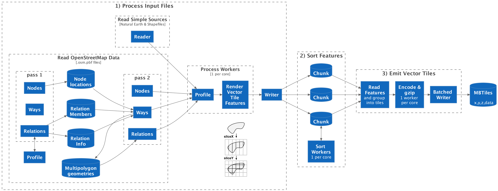

# Planetiler Architecture

Planetiler builds a map in 3 phases:

1. [Process Input Files](#1-process-input-files) according to
   the [Profile](planetiler-core/src/main/java/com/onthegomap/planetiler/Profile.java) and write rendered tile features
   to intermediate files on disk
2. [Sort Features](#2-sort-features) by tile ID
3. [Emit Vector Tiles](#3-emit-vector-tiles) by iterating through sorted features to group by tile ID, encoding, and
   writing to the output MBTiles file

## 1) Process Input Files

First, Planetiler
reads [SourceFeatures](planetiler-core/src/main/java/com/onthegomap/planetiler/reader/SourceFeature.java)
from each input source:

- For "simple
  sources" [NaturalEarthReader](planetiler-core/src/main/java/com/onthegomap/planetiler/reader/NaturalEarthReader.java)
  or [ShapefileReader](planetiler-core/src/main/java/com/onthegomap/planetiler/reader/ShapefileReader.java) can get the
  latitude/longitude geometry directly from each feature
- For OpenStreetMap `.osm.pbf` files,
  [OsmReader](planetiler-core/src/main/java/com/onthegomap/planetiler/reader/osm/OsmReader.java)
  needs to make 2 passes through the input file to construct feature geometries:
  - pass 1:
    - nodes: store node latitude/longitude locations in-memory or on disk
      using [LongLongMap](planetiler-core/src/main/java/com/onthegomap/planetiler/collection/LongLongMap.java)
    - ways: nothing
    - relations: call `preprocessOsmRelation` on the profile and store information returned for each relation of
      interest, along with relation member IDs in-memory using
      a [LongLongMultimap](planetiler-core/src/main/java/com/onthegomap/planetiler/collection/LongLongMultimap.java).
  - pass 2:
    - nodes: emit a point source feature
    - ways:
      - lookup the latitude/longitude for each node ID to get the way geometry and relations that the way is contained
        in
      - emit a source feature with the reconstructed geometry which can either be a line or polygon, depending on
        the `area` tag and whether the way is closed
      - if this way is part of a multipolygon, also save the way geometry in-memory for later in
        a [LongLongMultimap](planetiler-core/src/main/java/com/onthegomap/planetiler/collection/LongLongMultimap.java)
    - relations: for any multipolygon relation, fetch the member geometries and attempt to reconstruct the multipolygon
      geometry
      using [OsmMultipolygon](planetiler-core/src/main/java/com/onthegomap/planetiler/reader/osm/OsmMultipolygon.java),
      then emit a polygon source feature with the reconstructed geometry if successful

Then, for each [SourceFeature](planetiler-core/src/main/java/com/onthegomap/planetiler/reader/SourceFeature.java),
render vector tile features according to
the [Profile](planetiler-core/src/main/java/com/onthegomap/planetiler/Profile.java) in a worker thread (default 1 per
core):

- Call `processFeature` method on the profile for each source feature
- For every vector tile feature added to
  the [FeatureCollector](planetiler-core/src/main/java/com/onthegomap/planetiler/FeatureCollector.java):
  - Call [FeatureRenderer#accept](planetiler-core/src/main/java/com/onthegomap/planetiler/render/FeatureRenderer.java)
    which for each zoom level the feature appears in:
    - Scale the geometry to that zoom level
    - Simplify it in screen pixel coordinates
    - Use [TiledGeometry](planetiler-core/src/main/java/com/onthegomap/planetiler/render/TiledGeometry.java)
      to slice the geometry into subcomponents that appear in every tile it touches using the stripe clipping algorithm
      derived from [geojson-vt](https://github.com/mapbox/geojson-vt):
      - `sliceX` splits the geometry into vertical slices for each "column" representing the X coordinate of a vector
        tile
      - `sliceY` splits each "column" into "rows" representing the Y coordinate of a vector tile
        - Uses an [IntRangeSet](planetiler-core/src/main/java/com/onthegomap/planetiler/collection/IntRangeSet.java) to
          optimize processing for large filled areas (like oceans)
      - If any features wrapped past -180 or 180 degrees longitude, repeat with a 360 or -360 degree offset
    - Reassemble each vector tile geometry and round to tile precision (4096x4096)
      - For
        polygons, [GeoUtils#snapAndFixPolygon](planetiler-core/src/main/java/com/onthegomap/planetiler/geo/GeoUtils.java)
        uses [JTS](https://github.com/locationtech/jts) utilities to fix any topology errors (i.e. self-intersections)
        introduced by rounding. This is very expensive, but necessary since clients
        like [MapLibre GL JS](https://github.com/maplibre/maplibre-gl-js) produce rendering artifacts for invalid
        polygons.
    - Encode the feature into compact binary format
      using [FeatureGroup#newRenderedFeatureEncoder](planetiler-core/src/main/java/com/onthegomap/planetiler/collection/FeatureGroup.java)
      consisting of a sortable 64-bit `long` key (zoom, x, y, layer, sort order) and a binary value encoded
      using [MessagePack](https://msgpack.org/) (feature group/limit, feature ID, geometry type, tags, geometry)
    - Add the encoded feature to
      a [WorkQueue](planetiler-core/src/main/java/com/onthegomap/planetiler/worker/WorkQueue.java)

Finally, a single-threaded writer reads encoded features off of the work queue and writes them to disk
using [ExternalMergeSort#add](planetiler-core/src/main/java/com/onthegomap/planetiler/collection/ExternalMergeSort.java)

- Write features to a "chunk" file until that file hits a size limit (i.e. 1GB) then start writing to a new file

## 2) Sort Features

[ExternalMergeSort](planetiler-core/src/main/java/com/onthegomap/planetiler/collection/ExternalMergeSort.java) sorts all
of the intermediate features using a worker thread per core:

- Read each "chunk" file into memory
- Sort the features it contains by 64-bit `long` key
- Write the chunk back to disk

## 3) Emit Vector Tiles

[MbtilesWriter](planetiler-core/src/main/java/com/onthegomap/planetiler/mbtiles/MbtilesWriter.java) is the main driver.
First, a single-threaded reader reads features from disk:

- [ExternalMergeSort](planetiler-core/src/main/java/com/onthegomap/planetiler/collection/ExternalMergeSort.java) emits
  sorted features by doing a k-way merge using a priority queue of iterators reading from each sorted chunk
- [FeatureGroup](planetiler-core/src/main/java/com/onthegomap/planetiler/collection/FeatureGroup.java) collects
  consecutive features in the same tile into a `TileFeatures` instance, dropping features in the same group over the
  grouping limit to limit point label density
- Then [MbtilesWriter](planetiler-core/src/main/java/com/onthegomap/planetiler/mbtiles/MbtilesWriter.java) groups tiles
  into variable-sized batches for workers to process (complex tiles get their own batch to ensure workers stay busy
  while the writer thread waits for finished tiles in order)

Then, process tile batches in worker threads (default 1 per core):

- For each tile in the batch, first check to see if it has the same contents as the previous tile to avoid re-encoding
  the same thing for large filled areas (i.e. oceans)
- Encode using [VectorTile](planetiler-core/src/main/java/com/onthegomap/planetiler/VectorTile.java)
- gzip each encoded tile
- Pass the batch of encoded vector tiles to the writer thread

Finally, a single-threaded writer writes encoded vector tiles to the output MBTiles file:

- Create the largest prepared statement supported by SQLite (999 parameters)
- Iterate through finished vector tile batches until the prepared statement is full, flush to disk, then repeat
- Then flush any remaining tiles at the end
