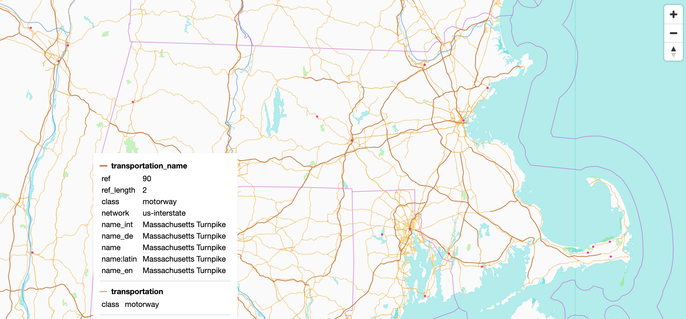

# Flatmap

Flatmap is a tool that generates [Mapbox Vector Tiles](https://github.com/mapbox/vector-tile-spec/tree/master/2.1) from
geographic data sources like [OpenStreetMap](https://www.openstreetmap.org/). Flatmap aims to be fast and
memory-efficient so that you can build a map of the world in a few hours on a single machine without any external tools
or database.

Vector tiles contain raw point, line, and polygon geometries that clients like [MapLibre](https://github.com/maplibre)
can use to render custom maps in the browser, native apps, or on a server. Flatmap packages tiles into
an [MBTiles](https://github.com/mapbox/mbtiles-spec/blob/master/1.3/spec.md) (sqlite) file that can be served using
tools like [TileServer GL](https://github.com/maptiler/tileserver-gl) or even
[queried directly from the browser](https://github.com/phiresky/sql.js-httpvfs).
See [awesome-vector-tiles](https://github.com/mapbox/awesome-vector-tiles) for more projects that work with data in this
format.

Flatmap is named after the "flatmap" operation that it performs: *map* input elements to rendered tile features,
*flatten* them into a big list, and sort by tile ID to group into tiles. The output is also a "flat map" where zoom
level 0 contains the entire planet in a 256x256 px tile, and each zoom level splits parent tiles into 4 quadrants,
revealing more detail.

See [ARCHITECTURE.md](ARCHITECTURE.md) for more details on how Flatmap works.

## Demo

See the [live demo](https://onthegomap.github.io/flatmap-demo/) of vector tiles created by Flatmap.

[](https://onthegomap.github.io/flatmap-demo/)
Style [© OpenMapTiles](https://www.openmaptiles.org/)
&middot; Data [© OpenStreetMap contributors](https://www.openstreetmap.org/copyright)

## Usage

To generate a map of an area using the [basemap profile](flatmap-basemap), you will need:

- [Java 16+](https://adoptium.net/installation.html) or [Docker](https://docs.docker.com/get-docker/)
- at least 1GB of free disk space plus 5-10x the size of the `.osm.pbf` file
- at least 1.5x as much free RAM as the input `.osm.pbf` file size

#### To build the map:

Using Java, download `flatmap.jar` from the [latest release](https://github.com/onthegomap/flatmap/releases/latest)
and run it:

```bash
wget https://github.com/onthegomap/flatmap/releases/latest/download/flatmap.jar
java -Xmx1g -jar flatmap.jar --download --area=monaco
```

Or using Docker:

```bash
docker run -e JAVA_TOOL_OPTIONS="-Xmx1g" -v "$(pwd)/data":/data ghcr.io/onthegomap/flatmap:latest --download --area=monaco
```

#### To view tiles locally:

Using [Node.js](https://nodejs.org/en/download/):

```bash
npm install -g tileserver-gl-light
tileserver-gl-light --mbtiles data/output.mbtiles
```

Or using [Docker](https://docs.docker.com/get-docker/):

```bash
docker run --rm -it -v "$(pwd)/data":/data -p 8080:8080 maptiler/tileserver-gl -p 8080
```

Then open http://localhost:8080 to view tiles.

Some common arguments:

- `--download` downloads input sources automatically and `--only-download` exits after downloading
- `--area=monaco` downloads a `.osm.pbf` extract from [Geofabrik](https://download.geofabrik.de/)
- `--osm-path=path/to/file.osm.pbf` points Flatmap at an existing OSM extract on disk
- `-Xmx1g` controls how much RAM to give the JVM (recommended: 0.5x the input .osm.pbf file size to leave room for
  memory-mapped files)
- `--force` overwrites the output file
- `--help` shows all of the options and exits

## Generating a Map of the World

See [PLANET.md](PLANET.md).

## Creating a Custom Map

See the [flatmap-examples](flatmap-examples) project.

## Benchmarks

Some example runtimes (excluding downloading resources):

| Input | Input Size | Profile | Machine | Time | mbtiles size | Logs |
| --- | --- | --- | --- | --- | --- | --- |
| s3://osm-pds/2021/planet-211011.osm.pbf | 64.7GB | Basemap | DO 16cpu 128GB RAM | 3h9m (cpu: 42h1m @ 13.3) | 99.6GB | [logs](planet-logs/v0.1.0-planet-do-16cpu-128gb.txt), [VisualVM Profile](planet-logs/v0.1.0-planet-do-16cpu-128gb.nps) |
| [Daylight Distribution v1.6](https://daylightmap.org/2021/09/29/daylight-v16-released.html) with ML buildings and admin boundaries | 68.6GB | Basemap | DO 16cpu 128GB RAM | 3h13m (cpu: 43h40m @ 13.5) | 101.4GB | [logs](planet-logs/v0.1.0-daylight-do-16cpu-128gb.txt) |
| s3://osm-pds/2021/planet-211011.osm.pbf | 64.7GB | Basemap | Linode 50cpu 128GB RAM | 3h9m (cpu: 42h1m @ 13.3) | 99.6GB | [logs](planet-logs/v0.1.0-planet-linode-50cpu-128gb.txt), [VisualVM Profile](planet-logs/v0.1.0-planet-linode-50cpu-128gb.nps) |
| s3://osm-pds/2021/planet-211011.osm.pbf | 64.7GB | Basemap (without z13 building merge) | c5ad.16xlarge (64cpu/128GB RAM) | 59m26s (cpu: 27h6m @ 27.4) | 97.3GB | [logs](planet-logs/v0.1.0-planet-c5ad-64cpu-128gb.txt) |

## Alternatives

Some other tools that generate vector tiles from OpenStreetMap data:

- [OpenMapTiles](https://github.com/openmaptiles/openmaptiles) is the reference implementation of
  the [OpenMapTiles schema](https://openmaptiles.org/schema/) that the [basemap profile](flatmap-basemap) is based on.
  It uses an intermediate postgres database and operates in two modes:
  1. Import data into database (~1 day) then serve vector tiles directly from the database. Tile serving is slower and
     requires bigger machines, but lets you easily incorporate realtime updates
  2. Import data into database (~1 day) then prerender every tile for the planet into an mbtiles file which
     takes [over 100 days](https://github.com/openmaptiles/openmaptiles/issues/654#issuecomment-724606293)
     or a cluster of machines, but then tiles can be served faster on smaller machines
- [Tilemaker](https://github.com/systemed/tilemaker) uses a similar approach to Flatmap (no intermediate database), is
  more mature, and has a convenient lua API for building custom profiles without recompiling the tool, but takes
  [about a day](https://github.com/systemed/tilemaker/issues/315#issue-994322040) to generate a map of the world

Some companies that generate and host tiles for you:

- [Mapbox](https://www.mapbox.com/) - data from the pioneer of vector tile technologies
- [Maptiler](https://www.maptiler.com/) - data from the creator of OpenMapTiles schema
- [Stadia Maps](https://stadiamaps.com/) - what [onthegomap.com](https://onthegomap.com/) uses in production

If you want to host tiles yourself but have someone else generate them for you, those companies also offer plans to
download regularly-updated tilesets.

## Features

- Supports [Natural Earth](https://www.naturalearthdata.com/),
  OpenStreetMap [.osm.pbf](https://wiki.openstreetmap.org/wiki/PBF_Format),
  and [Esri Shapefiles](https://en.wikipedia.org/wiki/Shapefile) data sources
- Java-based [Profile API](flatmap-core/src/main/java/com/onthegomap/flatmap/Profile.java) to customize how source
  elements map to vector tile features, and post-process generated tiles
  using [JTS geometry utilities](https://github.com/locationtech/jts)
- Automatically fixes self-intersecting polygons
- Built-in basemap profile based on [OpenMapTiles](https://openmaptiles.org/) v3.12.2
- Optionally download additional name translations for elements from Wikidata
- Export real-time stats to a [prometheus push gateway](https://github.com/prometheus/pushgateway) using
  `--pushgateway=http://user:password@ip` argument (and a [grafana dashboard](grafana.json) for viewing)
- Automatically downloads region extracts from [Geofabrik](https://download.geofabrik.de/)
  using `geofabrik:australia` shortcut as a source URL
- Unit-test profiles to verify mapping logic, or integration-test to verify the actual contents of a generated mbtiles
  file ([example](flatmap-examples/src/test/java/com/onthegomap/flatmap/examples/BikeRouteOverlayTest.java))

## Limitations

- It is harder to join and group data than when using database. To join input data sources, profiles must explicitly
  store data when processing a feature to use with later features, or apply post-processing to rendered features
  immediately before emitting the vector tile.
- Flatmap only does full imports from `.osm.pbf` snapshots, there is no way to incorporate real-time updates.

## Roadmap

- [x] Enough `flatmap-core` functionality to support basemap profile based on OpenMapTiles
- [ ] Basemap profile based on OpenMapTiles v3.12.2
  - [x] Port all layers
  - [x] Download name translations from wikidata
  - [x] Merge buildings at z13
  - [x] `adm0_l`/`adm0_r` boundary labels
  - [ ] Abbreviate road names to improve visibility
  - [ ] Poi layer `agg_stop` tag
- [ ] Get `flatmap-core` into Maven Central
- [ ] Remove geotools dependency for reading shapefiles (not in Maven Central)
- [ ] Remove graphhopper dependency for reading OSM files
- [ ] "Sparse mode" to only store node and relation data for elements used by a profile
- [ ] Support zoom levels higher than 14
- [ ] Handle nodes and relations in relations (only ways handled now)
- [ ] Lake centerline support in `flatmap-core`
- [ ] Improve line merging to combine nearby parallel roads
- [ ] Basemap schema improvements for [onthegomap.com](https://onthegomap.com)
- [ ] Accept other kinds of data sources
- [ ] Extract reusable utilities for complex schemas from `flatmap-basemap` to `flatmap-core`
- [ ] Other schemas

## Contributing

Pull requests are welcome! See [CONTRIBUTING.md](CONTRIBUTING.md) for details.

## Support

Have a question or want to share something you've built? Start
a [GitHub discussion](https://github.com/onthegomap/flatmap/discussions).

Found a bug or have a feature request? Open a [GitHub issue](https://github.com/onthegomap/flatmap/issues) to report.

This is a side project, so support is limited. If you have the time and ability, feel free to open a pull request to fix
issues or implement new features.

## Acknowledgement

Flatmap is made possible by these awesome open source projects:

- [OpenMapTiles](https://openmaptiles.org/) for the [schema](https://openmaptiles.org/schema/)
  and [reference implementation](https://github.com/openmaptiles/openmaptiles)
  that the [basemap profile](flatmap-basemap/src/main/java/com/onthegomap/flatmap/basemap/layers)
  is based on
- [Graphhopper](https://www.graphhopper.com/) for utilities to process OpenStreetMap data in Java
- [JTS Topology Suite](https://github.com/locationtech/jts) for working with vector geometries
- [Geotools](https://github.com/geotools/geotools) for shapefile processing
- [SQLite JDBC Driver](https://github.com/xerial/sqlite-jdbc) for reading Natural Earth data and writing MBTiles files
- [MessagePack](https://msgpack.org/) for compact binary encoding of intermediate map features
- [geojson-vt](https://github.com/mapbox/geojson-vt) for the basis of
  the [stripe clipping algorithm](flatmap-core/src/main/java/com/onthegomap/flatmap/render/TiledGeometry.java)
  that flatmap uses to slice geometries into tiles
- [java-vector-tile](https://github.com/ElectronicChartCentre/java-vector-tile) for the basis of
  the [vector tile encoder](flatmap-core/src/main/java/com/onthegomap/flatmap/VectorTile.java)
- [imposm3](https://github.com/omniscale/imposm3) for the basis
  of [OSM multipolygon processing](flatmap-core/src/main/java/com/onthegomap/flatmap/reader/osm/OsmMultipolygon.java)
  and [tag parsing utilities](flatmap-core/src/main/java/com/onthegomap/flatmap/util/Imposm3Parsers.java)

See [NOTICE.md](NOTICE.md) for a full list and license details.

## Author

Flatmap was created by [Michael Barry](https://github.com/msbarry) for future use generating custom basemaps or overlays
for [On The Go Map](https://onthegomap.com).

## License and Attribution

Flatmap source code is licensed under the [Apache 2.0 License](LICENSE), so it can be used and modified in commercial or
other open source projects according to the license guidelines.

Maps built using flatmap do not require any special attribution, but the data or schema used might. Any maps generated
from OpenStreetMap data must [visibly credit OpenStreetMap contributors](https://www.openstreetmap.org/copyright). Any
map generated with the profile based on OpenMapTiles or a derivative
must [visibly credit OpenMapTiles](https://github.com/openmaptiles/openmaptiles/blob/master/LICENSE.md#design-license-cc-by-40)
as well.

